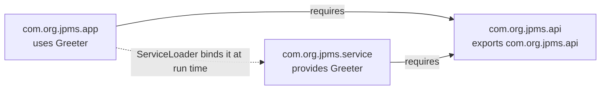

# <span style="color:hsl(224,80%,58%)">JPMS example (Java Platform Module System)</span>

Three modules, one Maven reactor, no shared classpath:

```
jpms-api      module com.org.jpms.api      exports com.org.jpms.api          (Greeter interface)
jpms-service  module com.org.jpms.service  requires com.org.jpms.api          provides Greeter with EnglishGreeter, SpanishGreeter
                                            keeps com.org.jpms.service.internal unexported
jpms-app      module com.org.jpms.app      requires com.org.jpms.api          uses com.org.jpms.api.Greeter
```

`jpms-app` never depends on `jpms-service` at compile time. It finds
implementations through [`ServiceLoader.load(Greeter.class)`][ServiceLoader], and Java's
module resolver pulls `jpms-service` into the module graph at run time
because it provides a service the app `uses`.



`com.org.jpms.service.internal` holds a public class (`GreetingFormatter`) that
is never `exports`ed — it's reachable inside the module but invisible
(compile *and* reflection) to `jpms-app` or anything else. That's the
strong-encapsulation half of JPMS; services are the loose-coupling half.

## <span style="color:hsl(2,80%,58%)">Build</span>

From the repository root, build the three modules (`-am` also builds the
api and service modules the app depends on, and the parent poms):

```bash
mvn -pl jpms/app -am package
```

A plain `mvn verify` at the root builds them too, along with the other modules.

## <span style="color:hsl(139,80%,58%)">Run</span>

From the `jpms` directory:

```bash
java --module-path api/target/jpms-api-1.0-SNAPSHOT.jar:service/target/jpms-service-1.0-SNAPSHOT.jar:app/target/jpms-app-1.0-SNAPSHOT.jar \
  -m com.org.jpms.app/com.org.jpms.app.Main YourName
```

Expected output:

```
[English] Hello, YourName!
[Spanish] Hola, YourName!
```

## <span style="color:hsl(277,80%,58%)">Inspect the module graph</span>

```bash
java --module-path api/target/jpms-api-1.0-SNAPSHOT.jar:service/target/jpms-service-1.0-SNAPSHOT.jar \
  --describe-module com.org.jpms.service
```

(The module path needs the JAR names spelled out: a `*.jar` glob inside a
colon-separated path is not expanded by the shell, and Java does not expand it either.)

Shows `contains com.org.jpms.service.internal` (not `exports`) — proof
the package is compiled in but sealed off from other modules.

<!-- Library classes mentioned above, linked to their source at the versions this project builds with. -->

[ServiceLoader]: https://github.com/openjdk/jdk/blob/jdk-27-ga/src/java.base/share/classes/java/util/ServiceLoader.java
